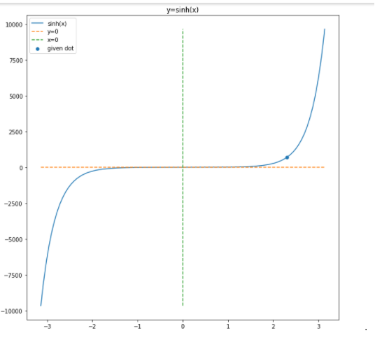
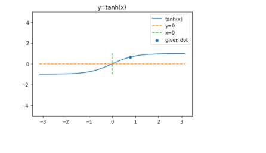
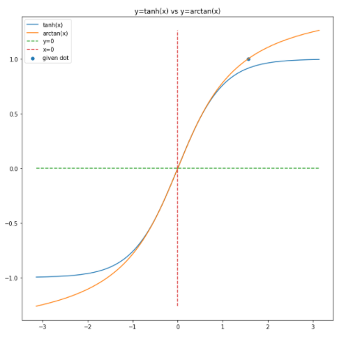
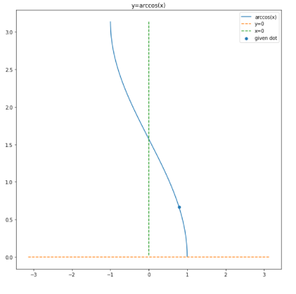

# matplotlib
 Hi
 I'm nilou 
 if you are a fan of pyplot and you were wondering if you could plot famouse mathematical functions with it, you are in a right place.
 first, you have to import my functions in plot.py then you can use all of the functions i code inside it
   HAVE FUN   
>from plot.py import *
 from math import pi
   *# examples of functions:*
 *# plot_sin(x , y , number of duration in a sine function)*
> plot_sin(3,pi*0.5,1)       

   *

>plot_cos(3,pi*0.5,0)
  

   *

>plot_tan(3,pi/4,1) 
  

   *

>plot_sinh(2.3*pi,np.sinh(2.3*pi))
  

   *

plot_cosh(2.3*pi,np.cosh(2.3*pi))
  

   *

plot_tanh(pi/4,np.tanh(pi/4))
  

   *

 *#the given dot is only in arctan dunction*
 plot_arctan_tanh(pi/2,np.arctan(pi/2))
  

   *

#the given dot is on tanh function
plot_arctan_tanh(pi/2,np.tanh(pi/2))
  

   *

plot_arcsin(-pi/4,np.arcsin(-pi/4))
  

   *

plot_arccos(pi/4,np.arccos(pi/4))
  

   *

